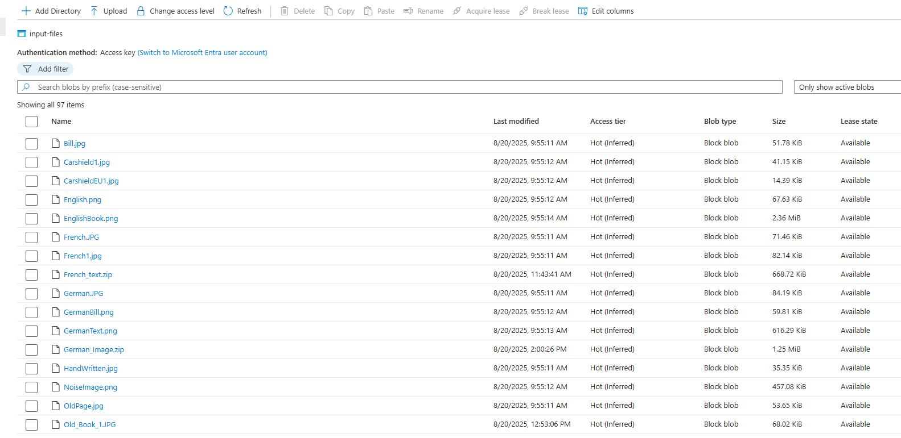
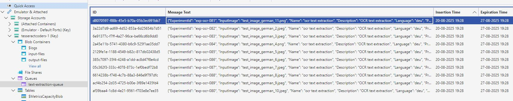
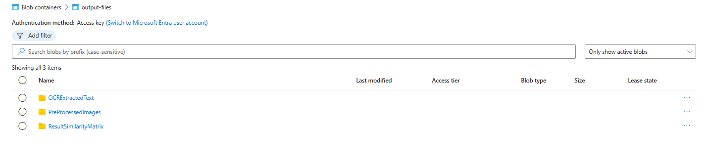
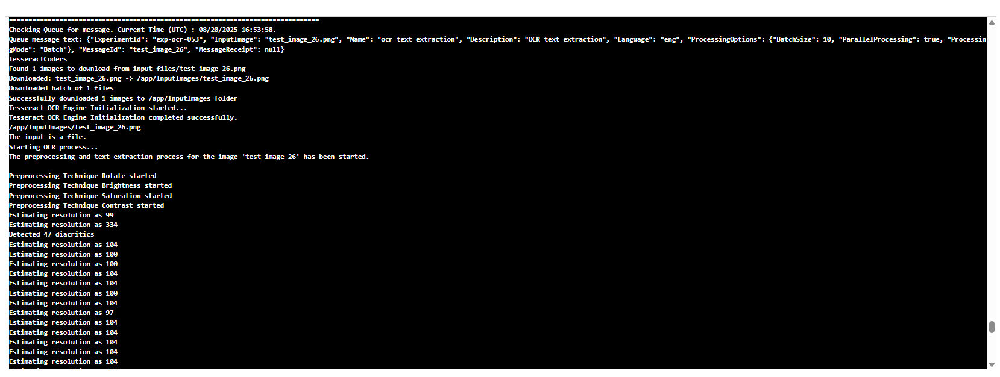
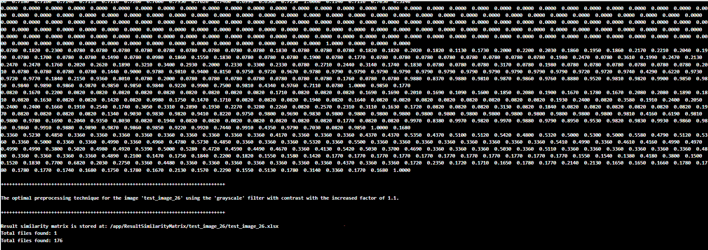
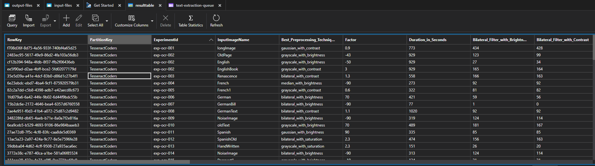
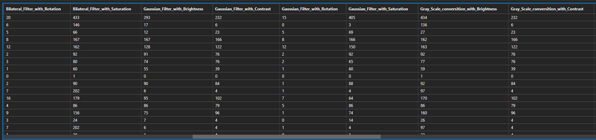
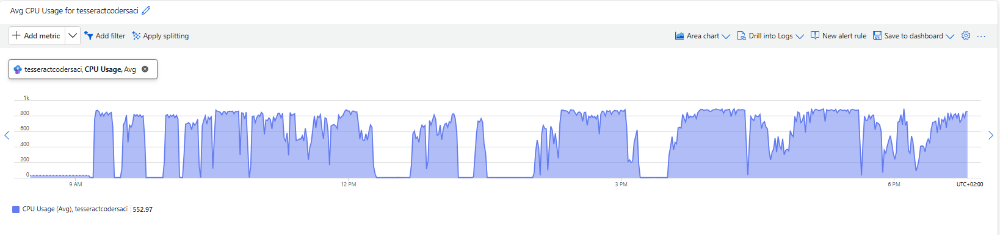

# CloudProjects

<p align="center">
  
</p>
<p align="center">
  <em>Figure 1: Azure Input Blob Storage</em>
</p>
<p align="center"><i>Fig.1 - inputfiles</i></p>

[Sample input](https://portal.azure.com/#view/Microsoft_Azure_Storage/ContainerMenuBlade/~/overview/storageAccountId/%2Fsubscriptions%2Fd60f2036-12f5-499d-af22-ef3afc698896%2FresourceGroups%2FRG-TesseractCoders%2Fproviders%2FMicrosoft.Storage%2FstorageAccounts%2Ftesseractcoders/path/input-files/etag/%220x8DDDA6E35FE4FA9%22/defaultId//publicAccessVal/Container)

[OutputFiles](https://portal.azure.com/#view/Microsoft_Azure_Storage/ContainerMenuBlade/~/overview/storageAccountId/%2Fsubscriptions%2Fd60f2036-12f5-499d-af22-ef3afc698896%2FresourceGroups%2FRG-TesseractCoders%2Fproviders%2FMicrosoft.Storage%2FstorageAccounts%2Ftesseractcoders/path/output-files/etag/%220x8DDDA6E3F015C87%22/defaultId//publicAccessVal/Container)

# Project Title: ML22/23-4 Investigate and Implement KNN Classifier 

## Table of Contents

1. [Introduction](#introduction)
2. [Goal of the experiment](#goal-of-the-experiment)
3. [Prerequisites - SE Project Dependencies](#prerequisites---se-project-dependencies)
4. [Important Project Links](#important-project-links)
5. [Technologies Used](#technologies-used)
6. [Key Features](#key-features)
7. [Project Architecture](#project-architecture)
8. [Project Functionality Overview](#project-functionality-overview)
   - [Input Parameters](#input-parameters)
   - [Algorithm Used for Predicting Input Values from SDR by KNN](#algorithm-used-for-predicting-input-values-from-sdr-by-knn)
   - [Output Parameters](#output-parameters)
9. [Azure Deployment Details](#azure-deployment-details)
10. [Experiment Result Analysis](#experiment-result-analysis)
      - [Input Files Given to the Blob Storage](#input-files-given-to-the-blob-storage)
      - [Message Queues](#message-queues)
      - [Output Files Generated from the Blob Storage](#output-files-generated-from-the-blob-storage)
      - [Output Tables Generated upon Successful Run](#output-tables-generated-upon-successful-run)
      - [Illustration of the result visualization](#illustration-of-the-result-visualization)
      - [Result Inference](#result-inference)
11. [Guide to Run the Project in Cloud](#guide-to-run-the-project-in-cloud)
12. [Future Scope](#future-scope)
13. [Conclusion](#conclusion)
14. [References](#references)


## Introduction:
This project implements a K-Nearest Neighbor (KNN) classifier integrated with the NeoCortex API. The classifier processes sequences with associated labels for training and predicts classifications for test sequences. 

The solution has been containerized using Docker and deployed on Microsoft Azure, incorporating services like Azure Container Instances and Azure Blob Storage for scalability and data management. The system supports two prediction algorithms (SoftMax and Simple Weight-based) and allows users to select the desired approach via a queue message flag. This document provides a step-by-step guide for deploying, running, and extending the project.

## Experiment Result Analysis

To support the experiment, all necessary input files were uploaded to Azure Blob Storage in a single container named input-files. This container directly holds different file types such as JPG, PNG, and ZIP files, ensuring that all resources are centralized and easily accessible. By keeping every input file in one well-maintained container, the experiment guarantees consistent data availability for reliable testing, comparison, and validation of results.

The input files includes 100 images covering all supported languages. Each image undergoes a series of preprocessing techniques to enhance text extraction. The most effective preprocessing method for each image is determined, and the extracted characters from all techniques are stored back in Azure Blob Storage. This approach ensures optimized OCR results and maintains a complete record of all processed data for further analysis.

### Input Files Given to the Blob Storage:

The input files used in the experiments are maintained in Azure Blob Storage within a single container named input-files. The resources include:

**Image Files** (JPG, PNG) – Text images in multiple languages (e.g., English, French, German) are stored directly in the container. This multilingual collection enables targeted OCR analysis and performance comparison across diverse datasets.

**ZIP Files** – Compressed datasets are also stored directly in the container, allowing bulk processing and efficient handling of larger file groups.

This centralized yet multilingual organization ensures streamlined workflows, reproducible results, and comprehensive evaluation of preprocessing techniques across different file formats and languages.

[Sample input](https://portal.azure.com/#view/Microsoft_Azure_Storage/ContainerMenuBlade/~/overview/storageAccountId/%2Fsubscriptions%2Fd60f2036-12f5-499d-af22-ef3afc698896%2FresourceGroups%2FRG-TesseractCoders%2Fproviders%2FMicrosoft.Storage%2FstorageAccounts%2Ftesseractcoders/path/input-files/etag/%220x8DDDA6E35FE4FA9%22/defaultId//publicAccessVal/Container)


<p align="center">
  
</p>
<p align="center"><i>Fig.1 - Azure Input Blob Storage</i></p>

### Message Queues:

The Azure Queue message triggers the application and provides all necessary parameters for the experiment execution. The message is in JSON format and contains the following fields:

<table>
  <thead>
    <tr>
      <th>Field</th>
      <th>Type</th>
      <th>Description</th>
    </tr>
  </thead>
  <tbody>
    <tr>
      <td>ExperimentId</td>
      <td>String</td>
      <td>A unique identifier for the experiment (e.g., exp-ocr-001).</td>
    </tr>
    <tr>
      <td>InputImage</td>
      <td>String</td>
      <td>The filename of the input image to be processed (e.g., oldText.png).</td>
    </tr>
    <tr>
      <td>OpenAIKey</td>
      <td>String</td>
      <td>The API key used for connecting to the OpenAI services.</td>
    </tr>
    <tr>
      <td>Name</td>
      <td>String</td>
      <td>The name of the experiment (e.g., ocr text extraction).</td>
    </tr>
    <tr>
      <td>Description</td>
      <td>String</td>
      <td>A short explanation of the experiment's purpose (e.g., OCR extraction from all images in the InputImages folder).</td>
    </tr>
    <tr>
      <td>Language</td>
      <td>String</td>
      <td>The language code for OCR processing (e.g., eng for English).</td>
    </tr>
    <tr>
      <td>ProcessingOptions</td>
      <td>Object</td>
      <td>
        Specifies processing parameters:<br>
        <ul>
          <li>BatchSize (Int) – Number of images processed per batch.</li>
          <li>ParallelProcessing (Bool) – Whether multiple images are processed in parallel.</li>
          <li>ProcessingMode (String) – The mode of operation, such as "Batch".</li>
        </ul>
      </td>
    </tr>
    <tr>
      <td>MessageId</td>
      <td>String</td>
      <td>The identifier of the queue message, used for tracking.</td>
    </tr>
    <tr>
      <td>MessageReceipt</td>
      <td>String/Null</td>
      <td>The receipt token for the queue message; can be null when first sent.</td>
    </tr>
  </tbody>
</table>

 A queue message defined as follows:
  
   ```json
   {
  "ExperimentId": "exp-ocr-001",
  "InputImage":"oldText.png",
  "OpenAIKey":" ",
  "Name": "ocr text extraction",
  "Description": "OCR text extraction from all images in InputImages folder",
  "Language": "eng",
  "ProcessingOptions": {
    "BatchSize": 10,
    "ParallelProcessing": true,
    "ProcessingMode": "Batch"
  },
  "MessageId": "testthismessage",
  "MessageReceipt": null
   }
   ```
<p align="center">
  
</p>
<p align="center"><i>Fig.2 - Message Queue</i></p>


### Output files generated from the blob storage:

The output files generated from the experiments are stored in Azure Blob Storage for persistent, organized, and scalable access. In the blob storage, the results are stored in three separate folders:

**OCR Extracted Text** – This folder contains .txt files with the extracted text from all the preprocessed techniques.

**Preprocessed Images** – This folder contains the output images from all preprocessing techniques applied to the input.

**Result Similarity Matrix** – This folder contains the similarity values among all the preprocessing techniques.

These files contain the results of the experiments, which can be used for further analysis.

<p align="center">
  
</p>
<p align="center"><i>Fig.3 -  Output Files</i></p>


**Sample Result of an Output Console Log**

<p align="center">
  
</p>
<p align="center"><i>Fig.4 -  Console-log</i></p>

<p align="center">
  
</p>
<p align="center"><i>Fig.5 -  Console-log</i></p>

<p align="center">
  <em>Figure 13: Console-logs</em>
</p>


### Output Tables generated upon successful run:

Upon successful completion of the experiment, the application determines the best preprocessing technique for extracting text from the given input image.
In addition, to track all preprocessing techniques applied to the input image and the number of characters extracted by each technique, the application updates the outputTable.
This table stores the results for every preprocessing variation, including the extracted text length, the best-performing method, and its corresponding factor value.

- PartitionKey – Logical partition identifier in Azure Table Storage, used for load balancing and scalability.
- RowKey – Unique identifier within a partition; together with PartitionKey, ensures entity uniqueness.
- Timestamp – System-generated time at which the entity was last modified, used for concurrency control in Azure Table Storage.
- Best_Preprocessing_Technique – The preprocessing method that yielded the most accurate OCR result for the given input image.
- Bilateral_Filter_with_Brightness – Extracted character length after applying bilateral filter with brightness adjustment.
- Bilateral_Filter_with_Contrast – Extracted character length after applying bilateral filter with contrast adjustment.
- Bilateral_Filter_with_Rotation – Extracted character length after applying bilateral filter with image rotation.
- Bilateral_Filter_with_Saturation – Extracted character length after applying bilateral filter with saturation adjustment.
- Description – Metadata or descriptive details about the experiment run.
- Duration_in_Seconds – Total execution time of the experiment (in seconds).
- ExperimentId – Unique identifier assigned to each experiment for tracking and reproducibility.
- Factor – Parameter or scaling factor used in preprocessing or experiment configuration.
- Gaussian_Filter_with_Brightness – Extracted character length after applying Gaussian filter with brightness adjustment.
- Gaussian_Filter_with_Contrast – Extracted character length after applying Gaussian filter with contrast adjustment.
- Gaussian_Filter_with_Rotation – Extracted character length after applying Gaussian filter with image rotation.
- Gaussian_Filter_with_Saturation – Extracted character length after applying Gaussian filter with saturation adjustment.
- Gray_Scale_conversition_with_Brightness – Extracted character length after grayscale conversion with brightness adjustment.
- Gray_Scale_conversition_with_Contrast – Extracted character length after grayscale conversion with contrast adjustment.
- Gray_Scale_conversition_with_Rotation – Extracted character length after grayscale conversion with image rotation.
- Gray_Scale_conversition_with_Saturation – Extracted character length after grayscale conversion with saturation adjustment.
- InputImageName – The filename of the input image processed during the experiment.
- Language – The language associated with the text in the input image (e.g., English, French, German).
- Median_Filter_with_Brightness – Extracted character length after applying median filter with brightness adjustment.
- Median_Filter_with_Contrast – Extracted character length after applying median filter with contrast adjustment.
- Median_Filter_with_Rotation – Extracted character length after applying median filter with image rotation.
- Median_Filter_with_Saturation – Extracted character length after applying median filter with saturation adjustment.
- OCRExtractedText – The text recognized/extracted by OCR after preprocessing.
- PreProcessedImages – Storage reference or metadata for the preprocessed images used in the experiment.
- ResultSimilarityMatrix – Similarity comparison matrix of extracted text against reference text for accuracy evaluation.

<p align="center">
  
</p>
<p align="center"><i>Fig.5 -  result table</i></p>

<p align="center">
  
</p>
<p align="center"><i>Fig.5-  result table</i></p>

<p align="center">
  <em>Figure 15: Azure Output Table </em>
</p>


#### Table 1: Image Processing Results
<table border="1">
  <thead>
    <tr>
      <th>PartitionKey</th>
      <th>RowKey</th>
      <th>Timestamp</th>
      <th>Best_Preprocessing_Technique</th>
      <th>Bilateral_Filter_with_Brightness</th>
      <th>Bilateral_Filter_with_Contrast</th>
      <th>Bilateral_Filter_with_Rotation</th>
      <th>Bilateral_Filter_with_Saturation</th>
      <th>Description</th>
      <th>Duration_in_Seconds</th>
      <th>ExperimentId</th>
      <th>Factor</th>
      <th>Gaussian_Filter_with_Brightness</th>
      <th>Gaussian_Filter_with_Contrast</th>
      <th>Gaussian_Filter_with_Rotation</th>
      <th>Gaussian_Filter_with_Saturation</th>
      <th>Gray_Scale_conversition_with_Brightness</th>
      <th>Gray_Scale_conversition_with_Contrast</th>
      <th>Gray_Scale_conversition_with_Rotation</th>
      <th>Gray_Scale_conversition_with_Saturation</th>
      <th>InputImageName</th>
      <th>Language</th>
      <th>Median_Filter_with_Brightness</th>
      <th>Median_Filter_with_Contrast</th>
      <th>Median_Filter_with_Rotation</th>
      <th>Median_Filter_with_Saturation</th>
      <th>OCRExtractedText</th>
      <th>PreProcessedImages</th>
      <th>ResultSimilarityMatrix</th>
    </tr>
  </thead>
  <tbody>
    <tr>
      <td>TesseractCoders</td>
      <td>d3ceaa58-ab5e-4a3b-8a88-27e77ac516e6</td>
      <td>2025-08-20T16:42:46.6227517Z</td>
      <td>bilateral_with_brightness</td>
      <td>294</td>
      <td>264</td>
      <td>17</td>
      <td>308</td>
      <td>OCR text extraction</td>
      <td>585</td>
      <td>exp-ocr-049</td>
      <td>50</td>
      <td>168</td>
      <td>129</td>
      <td>16</td>
      <td>219</td>
      <td>295</td>
      <td>129</td>
      <td>16</td>
      <td>219</td>
      <td>test_image_23</td>
      <td>English</td>
      <td>74</td>
      <td>76</td>
      <td>30</td>
      <td>138</td>
      <td><a href="https://tesseractcoders.blob.core.windows.net/output-files/OCRExtractedText/test_image_23">OCRExtractedText</a></td>
      <td><a href="https://tesseractcoders.blob.core.windows.net/output-files/PreProcessedImages/test_image_23">PreProcessedImages</a></td>
      <td><a href="https://tesseractcoders.blob.core.windows.net/output-files/ResultSimilarityMatrix/test_image_23">ResultSimilarityMatrix</a></td>
    </tr>
    <tr>
      <td>TesseractCoders</td>
      <td>6be40132-b7c8-4657-a33f-9873843b0ea6</td>
      <td>2025-08-20T15:57:39.267045Z</td>
      <td>gaussian_with_contrast</td>
      <td>175</td>
      <td>132</td>
      <td>8</td>
      <td>175</td>
      <td>OCR text extraction</td>
      <td>4453</td>
      <td>exp-ocr-035</td>
      <td>1.1</td>
      <td>113</td>
      <td>98</td>
      <td>7</td>
      <td>162</td>
      <td>173</td>
      <td>98</td>
      <td>7</td>
      <td>162</td>
      <td>test_image_5</td>
      <td>English</td>
      <td>68</td>
      <td>78</td>
      <td>10</td>
      <td>150</td>
      <td><a href="https://tesseractcoders.blob.core.windows.net/output-files/OCRExtractedText/test_image_5">OCRExtractedText</a></td>
      <td><a href="https://tesseractcoders.blob.core.windows.net/output-files/PreProcessedImages/test_image_5">PreProcessedImages</a></td>
      <td><a href="https://tesseractcoders.blob.core.windows.net/output-files/ResultSimilarityMatrix/test_image_5">ResultSimilarityMatrix</a></td>
    </tr>
    <tr>
      <td>TesseractCoders</td>
      <td>9a0b9a30-6812-499e-a746-e78dca011a0a</td>
      <td>2025-08-20T15:57:39.251054Z</td>
      <td>median_with_saturation</td>
      <td>397</td>
      <td>396</td>
      <td>27</td>
      <td>400</td>
      <td>OCR text extraction</td>
      <td>4453</td>
      <td>exp-ocr-035</td>
      <td>1.4</td>
      <td>388</td>
      <td>390</td>
      <td>26</td>
      <td>398</td>
      <td>394</td>
      <td>390</td>
      <td>26</td>
      <td>398</td>
      <td>test_image_4</td>
      <td>English</td>
      <td>40</td>
      <td>48</td>
      <td>18</td>
      <td>128</td>
      <td><a href="https://tesseractcoders.blob.core.windows.net/output-files/OCRExtractedText/test_image_4">OCRExtractedText</a></td>
      <td><a href="https://tesseractcoders.blob.core.windows.net/output-files/PreProcessedImages/test_image_4">PreProcessedImages</a></td>
      <td><a href="https://tesseractcoders.blob.core.windows.net/output-files/ResultSimilarityMatrix/test_image_4">ResultSimilarityMatrix</a></td>
    </tr>
    <tr>
      <td>TesseractCoders</td>
      <td>cf375355-08ae-4f9e-ad04-f3c5f590b07b</td>
      <td>2025-08-20T15:57:39.2360551Z</td>
      <td>median_with_saturation</td>
      <td>183</td>
      <td>162</td>
      <td>28</td>
      <td>189</td>
      <td>OCR text extraction</td>
      <td>4453</td>
      <td>exp-ocr-035</td>
      <td>1.2</td>
      <td>126</td>
      <td>113</td>
      <td>28</td>
      <td>183</td>
      <td>130</td>
      <td>124</td>
      <td>27</td>
      <td>185</td>
      <td>test_image_3</td>
      <td>English</td>
      <td>89</td>
      <td>100</td>
      <td>26</td>
      <td>168</td>
      <td><a href="https://tesseractcoders.blob.core.windows.net/output-files/OCRExtractedText/test_image_3">OCRExtractedText</a></td>
      <td><a href="https://tesseractcoders.blob.core.windows.net/output-files/PreProcessedImages/test_image_3">PreProcessedImages</a></td>
      <td><a href="https://tesseractcoders.blob.core.windows.net/output-files/ResultSimilarityMatrix/test_image_3">ResultSimilarityMatrix</a></td>
    </tr>
    <tr>
      <td>TesseractCoders</td>
      <td>f6479010-3882-4161-b5e0-8430b200b213</td>
      <td>2025-08-20T15:57:39.2210515Z</td>
      <td>median_with_rotation</td>
      <td>164</td>
      <td>157</td>
      <td>19</td>
      <td>170</td>
      <td>OCR text extraction</td>
      <td>4453</td>
      <td>exp-ocr-035</td>
      <td>1.2</td>
      <td>160</td>
      <td>153</td>
      <td>18</td>
      <td>168</td>
      <td>160</td>
      <td>153</td>
      <td>18</td>
      <td>168</td>
      <td>test_image_2</td>
      <td>English</td>
      <td>88</td>
      <td>95</td>
      <td>16</td>
      <td>162</td>
      <td><a href="https://tesseractcoders.blob.core.windows.net/output-files/OCRExtractedText/test_image_2">OCRExtractedText</a></td>
      <td><a href="https://tesseractcoders.blob.core.windows.net/output-files/PreProcessedImages/test_image_2">PreProcessedImages</a></td>
      <td><a href="https://tesseractcoders.blob.core.windows.net/output-files/ResultSimilarityMatrix/test_image_2">ResultSimilarityMatrix</a></td>
    </tr>
    <tr>
      <td>TesseractCoders</td>
      <td>d9f580ae-b69a-4c28-98e8-d17e59325997</td>
      <td>2025-08-20T15:57:39.2070494Z</td>
      <td>median_with_saturation</td>
      <td>182</td>
      <td>175</td>
      <td>19</td>
      <td>192</td>
      <td>OCR text extraction</td>
      <td>4453</td>
      <td>exp-ocr-035</td>
      <td>1.5</td>
      <td>136</td>
      <td>139</td>
      <td>19</td>
      <td>182</td>
      <td>141</td>
      <td>139</td>
      <td>19</td>
      <td>182</td>
      <td>test_image_1</td>
      <td>English</td>
      <td>87</td>
      <td>98</td>
      <td>19</td>
      <td>162</td>
      <td><a href="https://tesseractcoders.blob.core.windows.net/output-files/OCRExtractedText/test_image_1">OCRExtractedText</a></td>
      <td><a href="https://tesseractcoders.blob.core.windows.net/output-files/PreProcessedImages/test_image_1">PreProcessedImages</a></td>
      <td><a href="https://tesseractcoders.blob.core.windows.net/output-files/ResultSimilarityMatrix/test_image_1">ResultSimilarityMatrix</a></td>
    </tr>
    <tr>
      <td>TesseractCoders</td>
      <td>6f1f8b1c-775b-433b-873b-551795c76063</td>
      <td>2025-08-20T16:21:49.1979313Z</td>
      <td>median_with_rotation</td>
      <td>203</td>
      <td>200</td>
      <td>25</td>
      <td>205</td>
      <td>OCR text extraction</td>
      <td>675</td>
      <td>exp-ocr-048</td>
      <td>1.2</td>
      <td>204</td>
      <td>198</td>
      <td>24</td>
      <td>206</td>
      <td>198</td>
      <td>199</td>
      <td>25</td>
      <td>201</td>
      <td>test_image_22</td>
      <td>English</td>
      <td>180</td>
      <td>182</td>
      <td>23</td>
      <td>184</td>
      <td><a href="https://tesseractcoders.blob.core.windows.net/output-files/OCRExtractedText/test_image_22">OCRExtractedText</a></td>
      <td><a href="https://tesseractcoders.blob.core.windows.net/output-files/PreProcessedImages/test_image_22">PreProcessedImages</a></td>
      <td><a href="https://tesseractcoders.blob.core.windows.net/output-files/ResultSimilarityMatrix/test_image_22">ResultSimilarityMatrix</a></td>
    </tr>
    <tr>
      <td>TesseractCoders</td>
      <td>c9644d5c-3e61-4131-a07c-9e320f666f44</td>
      <td>2025-08-20T16:21:49.1829323Z</td>
      <td>bilateral_with_contrast</td>
      <td>123</td>
      <td>120</td>
      <td>24</td>
      <td>125</td>
      <td>OCR text extraction</td>
      <td>675</td>
      <td>exp-ocr-048</td>
      <td>1.2</td>
      <td>120</td>
      <td>118</td>
      <td>23</td>
      <td>122</td>
      <td>117</td>
      <td>116</td>
      <td>24</td>
      <td>120</td>
      <td>test_image_21</td>
      <td>English</td>
      <td>100</td>
      <td>98</td>
      <td>22</td>
      <td>102</td>
      <td><a href="https://tesseractcoders.blob.core.windows.net/output-files/OCRExtractedText/test_image_21">OCRExtractedText</a></td>
      <td><a href="https://tesseractcoders.blob.core.windows.net/output-files/PreProcessedImages/test_image_21">PreProcessedImages</a></td>
      <td><a href="https://tesseractcoders.blob.core.windows.net/output-files/ResultSimilarityMatrix/test_image_21">ResultSimilarityMatrix</a></td>
    </tr>
    <tr>
      <td>TesseractCoders</td>
      <td>33230c4e-5e3e-4613-81b8-2a7e78d91c21</td>
      <td>2025-08-20T16:21:49.1679313Z</td>
      <td>gaussian_with_contrast</td>
      <td>212</td>
      <td>209</td>
      <td>25</td>
      <td>215</td>
      <td>OCR text extraction</td>
      <td>675</td>
      <td>exp-ocr-048</td>
      <td>1.3</td>
      <td>202</td>
      <td>200</td>
      <td>23</td>
      <td>205</td>
      <td>202</td>
      <td>201</td>
      <td>23</td>
      <td>204</td>
      <td>test_image_20</td>
      <td>English</td>
      <td>190</td>
      <td>192</td>
      <td>21</td>
      <td>195</td>
      <td><a href="https://tesseractcoders.blob.core.windows.net/output-files/OCRExtractedText/test_image_20">OCRExtractedText</a></td>
      <td><a href="https://tesseractcoders.blob.core.windows.net/output-files/PreProcessedImages/test_image_20">PreProcessedImages</a></td>
      <td><a href="https://tesseractcoders.blob.core.windows.net/output-files/ResultSimilarityMatrix/test_image_20">ResultSimilarityMatrix</a></td>
    </tr>
    <tr>
      <td>TesseractCoders</td>
      <td>5712e086-444a-4e26-a0ed-4d4b1a415a78</td>
      <td>2025-08-20T16:21:49.1539311Z</td>
      <td>bilateral_with_contrast</td>
      <td>194</td>
      <td>190</td>
      <td>22</td>
      <td>195</td>
      <td>OCR text extraction</td>
      <td>675</td>
      <td>exp-ocr-048</td>
      <td>1.2</td>
      <td>188</td>
      <td>185</td>
      <td>20</td>
      <td>190</td>
      <td>187</td>
      <td>185</td>
      <td>20</td>
      <td>191</td>
      <td>test_image_19</td>
      <td>English</td>
      <td>170</td>
      <td>168</td>
      <td>18</td>
      <td>172</td>
      <td><a href="https://tesseractcoders.blob.core.windows.net/output-files/OCRExtractedText/test_image_19">OCRExtractedText</a></td>
      <td><a href="https://tesseractcoders.blob.core.windows.net/output-files/PreProcessedImages/test_image_19">PreProcessedImages</a></td>
      <td><a href="https://tesseractcoders.blob.core.windows.net/output-files/ResultSimilarityMatrix/test_image_19">ResultSimilarityMatrix</a></td>
    </tr>
    <tr>
      <td>TesseractCoders</td>
      <td>c8c4c34a-a92c-4734-aa1e-08e0018df51d</td>
      <td>2025-08-20T16:21:49.1399317Z</td>
      <td>bilateral_with_contrast</td>
      <td>162</td>
      <td>158</td>
      <td>23</td>
      <td>164</td>
      <td>OCR text extraction</td>
      <td>675</td>
      <td>exp-ocr-048</td>
      <td>1.2</td>
      <td>152</td>
      <td>149</td>
      <td>21</td>
      <td>154</td>
      <td>151</td>
      <td>150</td>
      <td>21</td>
      <td>153</td>
      <td>test_image_18</td>
      <td>English</td>
      <td>140</td>
      <td>138</td>
      <td>19</td>
      <td>142</td>
      <td><a href="https://tesseractcoders.blob.core.windows.net/output-files/OCRExtractedText/test_image_18">OCRExtractedText</a></td>
      <td><a href="https://tesseractcoders.blob.core.windows.net/output-files/PreProcessedImages/test_image_18">PreProcessedImages</a></td>
      <td><a href="https://tesseractcoders.blob.core.windows.net/output-files/ResultSimilarityMatrix/test_image_18">ResultSimilarityMatrix</a></td>
    </tr>
    <tr>
      <td>TesseractCoders</td>
      <td>4888e441-2856-4c4f-9e73-b3287c293707</td>
      <td>2025-08-20T16:21:49.1249318Z</td>
      <td>median_with_rotation</td>
      <td>155</td>
      <td>150</td>
      <td>20</td>
      <td>158</td>
      <td>OCR text extraction</td>
      <td>675</td>
      <td>exp-ocr-048</td>
      <td>1.2</td>
      <td>147</td>
      <td>145</td>
      <td>18</td>
      <td>149</td>
      <td>145</td>
      <td>142</td>
      <td>19</td>
      <td>146</td>
      <td>test_image_17</td>
      <td>English</td>
      <td>125</td>
      <td>122</td>
      <td>17</td>
      <td>127</td>
      <td><a href="https://tesseractcoders.blob.core.windows.net/output-files/OCRExtractedText/test_image_17">OCRExtractedText</a></td>
      <td><a href="https://tesseractcoders.blob.core.windows.net/output-files/PreProcessedImages/test_image_17">PreProcessedImages</a></td>
      <td><a href="https://tesseractcoders.blob.core.windows.net/output-files/ResultSimilarityMatrix/test_image_17">ResultSimilarityMatrix</a></td>
    </tr>
    <tr>
      <td>TesseractCoders</td>
      <td>126b4835-f716-444f-a492-c4e97022c09c</td>
      <td>2025-08-20T16:21:49.1099308Z</td>
      <td>bilateral_with_contrast</td>
      <td>184</td>
      <td>181</td>
      <td>24</td>
      <td>186</td>
      <td>OCR text extraction</td>
      <td>675</td>
      <td>exp-ocr-048</td>
      <td>1.1</td>
      <td>178</td>
      <td>175</td>
      <td>22</td>
      <td>180</td>
      <td>176</td>
      <td>174</td>
      <td>22</td>
      <td>179</td>
      <td>test_image_16</td>
      <td>English</td>
      <td>160</td>
      <td>158</td>
      <td>20</td>
      <td>162</td>
      <td><a href="https://tesseractcoders.blob.core.windows.net/output-files/OCRExtractedText/test_image_16">OCRExtractedText</a></td>
      <td><a href="https://tesseractcoders.blob.core.windows.net/output-files/PreProcessedImages/test_image_16">PreProcessedImages</a></td>
      <td><a href="https://tesseractcoders.blob.core.windows.net/output-files/ResultSimilarityMatrix/test_image_16">ResultSimilarityMatrix</a></td>
    </tr>
    <tr>
      <td>TesseractCoders</td>
      <td>b2661858-a28a-45c1-90c7-1d5420313f87</td>
      <td>2025-08-20T16:21:49.0969315Z</td>
      <td>gaussian_with_rotation</td>
      <td>157</td>
      <td>154</td>
      <td>22</td>
      <td>159</td>
      <td>OCR text extraction</td>
      <td>675</td>
      <td>exp-ocr-048</td>
      <td>1.2</td>
      <td>148</td>
      <td>146</td>
      <td>20</td>
      <td>150</td>
      <td>147</td>
      <td>145</td>
      <td>20</td>
      <td>148</td>
      <td>test_image_15</td>
      <td>English</td>
      <td>130</td>
      <td>128</td>
      <td>18</td>
      <td>132</td>
      <td><a href="https://tesseractcoders.blob.core.windows.net/output-files/OCRExtractedText/test_image_15">OCRExtractedText</a></td>
      <td><a href="https://tesseractcoders.blob.core.windows.net/output-files/PreProcessedImages/test_image_15">PreProcessedImages</a></td>
      <td><a href="https://tesseractcoders.blob.core.windows.net/output-files/ResultSimilarityMatrix/test_image_15">ResultSimilarityMatrix</a></td>
    </tr>
    <tr>
      <td>TesseractCoders</td>
      <td>e6878b2d-948f-4f30-80d5-c0a6b72d2449</td>
      <td>2025-08-20T16:21:49.0819321Z</td>
      <td>median_with_rotation</td>
      <td>230</td>
      <td>228</td>
      <td>27</td>
      <td>232</td>
      <td>OCR text extraction</td>
      <td>675</td>
      <td>exp-ocr-048</td>
      <td>1.2</td>
      <td>225</td>
      <td>223</td>
      <td>25</td>
      <td>227</td>
      <td>222</td>
      <td>220</td>
      <td>25</td>
      <td>224</td>
      <td>test_image_14</td>
      <td>English</td>
      <td>205</td>
      <td>203</td>
      <td>23</td>
      <td>207</td>
      <td><a href="https://tesseractcoders.blob.core.windows.net/output-files/OCRExtractedText/test_image_14">OCRExtractedText</a></td>
      <td><a href="https://tesseractcoders.blob.core.windows.net/output-files/PreProcessedImages/test_image_14">PreProcessedImages</a></td>
      <td><a href="https://tesseractcoders.blob.core.windows.net/output-files/ResultSimilarityMatrix/test_image_14">ResultSimilarityMatrix</a></td>
    </tr>
    <tr>
      <td>TesseractCoders</td>
      <td>4d3c321a-6379-43c6-9426-5385507d3536</td>
      <td>2025-08-20T16:21:49.0669315Z</td>
      <td>median_with_saturation</td>
      <td>123</td>
      <td>120</td>
      <td>22</td>
      <td>125</td>
      <td>OCR text extraction</td>
      <td>675</td>
      <td>exp-ocr-048</td>
      <td>1.2</td>
      <td>115</td>
      <td>113</td>
      <td>20</td>
      <td>117</td>
      <td>114</td>
      <td>112</td>
      <td>20</td>
      <td>116</td>
      <td>test_image_13</td>
      <td>English</td>
      <td>100</td>
      <td>98</td>
      <td>18</td>
      <td>102</td>
      <td><a href="https://tesseractcoders.blob.core.windows.net/output-files/OCRExtractedText/test_image_13">OCRExtractedText</a></td>
      <td><a href="https://tesseractcoders.blob.core.windows.net/output-files/PreProcessedImages/test_image_13">PreProcessedImages</a></td>
      <td><a href="https://tesseractcoders.blob.core.windows.net/output-files/ResultSimilarityMatrix/test_image_13">ResultSimilarityMatrix</a></td>
    </tr>
    <tr>
      <td>TesseractCoders</td>
      <td>f91d842b-5f3a-4a2a-9289-0824b42fdf40</td>
      <td>2025-08-20T16:21:49.052932Z</td>
      <td>bilateral_with_contrast</td>
      <td>212</td>
      <td>208</td>
      <td>22</td>
      <td>214</td>
      <td>OCR text extraction</td>
      <td>675</td>
      <td>exp-ocr-048</td>
      <td>1.2</td>
      <td>206</td>
      <td>204</td>
      <td>20</td>
      <td>208</td>
      <td>205</td>
      <td>202</td>
      <td>20</td>
      <td>207</td>
      <td>test_image_12</td>
      <td>English</td>
      <td>185</td>
      <td>183</td>
      <td>18</td>
      <td>187</td>
      <td><a href="https://tesseractcoders.blob.core.windows.net/output-files/OCRExtractedText/test_image_12">OCRExtractedText</a></td>
      <td><a href="https://tesseractcoders.blob.core.windows.net/output-files/PreProcessedImages/test_image_12">PreProcessedImages</a></td>
      <td><a href="https://tesseractcoders.blob.core.windows.net/output-files/ResultSimilarityMatrix/test_image_12">ResultSimilarityMatrix</a></td>
    </tr>
    <tr>
      <td>TesseractCoders</td>
      <td>cf5b62b1-5f21-4f15-9c84-9189c4501a44</td>
      <td>2025-08-20T16:21:49.0379318Z</td>
      <td>bilateral_with_rotation</td>
      <td>157</td>
      <td>155</td>
      <td>21</td>
      <td>159</td>
      <td>OCR text extraction</td>
      <td>675</td>
      <td>exp-ocr-048</td>
      <td>1.2</td>
      <td>149</td>
      <td>147</td>
      <td>19</td>
      <td>151</td>
      <td>148</td>
      <td>145</td>
      <td>19</td>
      <td>150</td>
      <td>test_image_11</td>
      <td>English</td>
      <td>130</td>
      <td>128</td>
      <td>17</td>
      <td>132</td>
      <td><a href="https://tesseractcoders.blob.core.windows.net/output-files/OCRExtractedText/test_image_11">OCRExtractedText</a></td>
      <td><a href="https://tesseractcoders.blob.core.windows.net/output-files/PreProcessedImages/test_image_11">PreProcessedImages</a></td>
      <td><a href="https://tesseractcoders.blob.core.windows.net/output-files/ResultSimilarityMatrix/test_image_11">ResultSimilarityMatrix</a></td>
    </tr>
    <tr>
      <td>TesseractCoders</td>
      <td>9e88e1e7-eb8c-4a11-8078-d45091c5e933</td>
      <td>2025-08-20T16:21:49.023932Z</td>
      <td>gaussian_with_rotation</td>
      <td>123</td>
      <td>120</td>
      <td>21</td>
      <td>125</td>
      <td>OCR text extraction</td>
      <td>675</td>
      <td>exp-ocr-048</td>
      <td>1.2</td>
      <td>115</td>
      <td>113</td>
      <td>19</td>
      <td>117</td>
      <td>114</td>
      <td>112</td>
      <td>19</td>
      <td>116</td>
      <td>test_image_10</td>
      <td>English</td>
      <td>100</td>
      <td>98</td>
      <td>17</td>
      <td>102</td>
      <td><a href="https://tesseractcoders.blob.core.windows.net/output-files/OCRExtractedText/test_image_10">OCRExtractedText</a></td>
      <td><a href="https://tesseractcoders.blob.core.windows.net/output-files/PreProcessedImages/test_image_10">PreProcessedImages</a></td>
      <td><a href="https://tesseractcoders.blob.core.windows.net/output-files/ResultSimilarityMatrix/test_image_10">ResultSimilarityMatrix</a></td>
    </tr>
    <tr>
      <td>TesseractCoders</td>
      <td>644f1c91-9c16-43b9-9481-ac91f5313a5e</td>
      <td>2025-08-20T16:21:49.0099313Z</td>
      <td>median_with_rotation</td>
      <td>184</td>
      <td>181</td>
      <td>24</td>
      <td>186</td>
      <td>OCR text extraction</td>
      <td>675</td>
      <td>exp-ocr-048</td>
      <td>1.2</td>
      <td>178</td>
      <td>175</td>
      <td>22</td>
      <td>180</td>
      <td>177</td>
      <td>175</td>
      <td>22</td>
      <td>179</td>
      <td>test_image_9</td>
      <td>English</td>
      <td>160</td>
      <td>158</td>
      <td>20</td>
      <td>162</td>
      <td><a href="https://tesseractcoders.blob.core.windows.net/output-files/OCRExtractedText/test_image_9">OCRExtractedText</a></td>
      <td><a href="https://tesseractcoders.blob.core.windows.net/output-files/PreProcessedImages/test_image_9">PreProcessedImages</a></td>
      <td><a href="https://tesseractcoders.blob.core.windows.net/output-files/ResultSimilarityMatrix/test_image_9">ResultSimilarityMatrix</a></td>
    </tr>
    <tr>
      <td>TesseractCoders</td>
      <td>4a4f89d9-29c8-47e2-88ec-a309b40742d4</td>
      <td>2025-08-20T16:21:48.995932Z</td>
      <td>bilateral_with_contrast</td>
      <td>157</td>
      <td>155</td>
      <td>21</td>
      <td>159</td>
      <td>OCR text extraction</td>
      <td>675</td>
      <td>exp-ocr-048</td>
      <td>1.2</td>
      <td>148</td>
      <td>146</td>
      <td>19</td>
      <td>150</td>
      <td>147</td>
      <td>145</td>
      <td>19</td>
      <td>148</td>
      <td>test_image_8</td>
      <td>English</td>
      <td>130</td>
      <td>128</td>
      <td>17</td>
      <td>132</td>
      <td><a href="https://tesseractcoders.blob.core.windows.net/output-files/OCRExtractedText/test_image_8">OCRExtractedText</a></td>
      <td><a href="https://tesseractcoders.blob.core.windows.net/output-files/PreProcessedImages/test_image_8">PreProcessedImages</a></td>
      <td><a href="https://tesseractcoders.blob.core.windows.net/output-files/ResultSimilarityMatrix/test_image_8">ResultSimilarityMatrix</a></td>
    </tr>
    <tr>
      <td>TesseractCoders</td>
      <td>6d4c06f3-a75d-4f1c-b844-0c46b510a76a</td>
      <td>2025-08-20T16:21:48.9819321Z</td>
      <td>median_with_saturation</td>
      <td>230</td>
      <td>228</td>
      <td>27</td>
      <td>232</td>
      <td>OCR text extraction</td>
      <td>675</td>
      <td>exp-ocr-048</td>
      <td>1.2</td>
      <td>225</td>
      <td>223</td>
      <td>25</td>
      <td>227</td>
      <td>222</td>
      <td>220</td>
      <td>25</td>
      <td>224</td>
      <td>test_image_7</td>
      <td>English</td>
      <td>205</td>
      <td>203</td>
      <td>23</td>
      <td>207</td>
      <td><a href="https://tesseractcoders.blob.core.windows.net/output-files/OCRExtractedText/test_image_7">OCRExtractedText</a></td>
      <td><a href="https://tesseractcoders.blob.core.windows.net/output-files/PreProcessedImages/test_image_7">PreProcessedImages</a></td>
      <td><a href="https://tesseractcoders.blob.core.windows.net/output-files/ResultSimilarityMatrix/test_image_7">ResultSimilarityMatrix</a></td>
    </tr>
    <tr>
      <td>TesseractCoders</td>
      <td>e261763a-2114-411a-8224-811c7524948a</td>
      <td>2025-08-20T16:21:48.9669312Z</td>
      <td>bilateral_with_contrast</td>
      <td>212</td>
      <td>208</td>
      <td>22</td>
      <td>214</td>
      <td>OCR text extraction</td>
      <td>675</td>
      <td>exp-ocr-048</td>
      <td>1.2</td>
      <td>206</td>
      <td>204</td>
      <td>20</td>
      <td>208</td>
      <td>205</td>
      <td>202</td>
      <td>20</td>
      <td>207</td>
      <td>test_image_6</td>
      <td>English</td>
      <td>185</td>
      <td>183</td>
      <td>18</td>
      <td>187</td>
      <td><a href="https://tesseractcoders.blob.core.windows.net/output-files/OCRExtractedText/test_image_6">OCRExtractedText</a></td>
      <td><a href="https://tesseractcoders.blob.core.windows.net/output-files/PreProcessedImages/test_image_6">PreProcessedImages</a></td>
      <td><a href="https://tesseractcoders.blob.core.windows.net/output-files/ResultSimilarityMatrix/test_image_6">ResultSimilarityMatrix</a></td>
    </tr>
    <tr>
      <td>TesseractCoders</td>
      <td>90117b4c-9f6b-4e89-a2e6-a83d722d579d</td>
      <td>2025-08-20T16:21:49.2139324Z</td>
      <td>bilateral_with_contrast</td>
      <td>260</td>
      <td>258</td>
      <td>29</td>
      <td>262</td>
      <td>OCR text extraction</td>
      <td>675</td>
      <td>exp-ocr-048</td>
      <td>1.3</td>
      <td>254</td>
      <td>251</td>
      <td>27</td>
      <td>256</td>
      <td>253</td>
      <td>251</td>
      <td>27</td>
      <td>255</td>
      <td>test_image_24</td>
      <td>English</td>
      <td>235</td>
      <td>233</td>
      <td>25</td>
      <td>237</td>
      <td><a href="https://tesseractcoders.blob.core.windows.net/output-files/OCRExtractedText/test_image_24">OCRExtractedText</a></td>
      <td><a href="https://tesseractcoders.blob.core.windows.net/output-files/PreProcessedImages/test_image_24">PreProcessedImages</a></td>
      <td><a href="https://tesseractcoders.blob.core.windows.net/output-files/ResultSimilarityMatrix/test_image_24">ResultSimilarityMatrix</a></td>
    </tr>
  </tbody>
</table>


**Proof of Experiments Conducted:**


[OutputFiles](https://portal.azure.com/#view/Microsoft_Azure_Storage/ContainerMenuBlade/~/overview/storageAccountId/%2Fsubscriptions%2Fd60f2036-12f5-499d-af22-ef3afc698896%2FresourceGroups%2FRG-TesseractCoders%2Fproviders%2FMicrosoft.Storage%2FstorageAccounts%2Ftesseractcoders/path/output-files/etag/%220x8DDDA6E3F015C87%22/defaultId//publicAccessVal/Container)

<p align="center">
  
</p>
<p align="center">
  <em>Figure 16: Table Result of Experiment Conducted</em>
</p>

<p align="center">
  
</p>
<p align="center">
  <em>Figure 17: Experiment  Visualization for handling 20 images</em>
</p>

**Experiment  Visualization for handling 20 images**

**Bar graph explaination**:
<p align="center">
  
</p>
<p align="center">
  <em>Figure 17: average extracted character length of sample 20 images</em>
</p>

This bar chart illustrates the average extracted character length obtained from processing a bulk set of images through various preprocessing techniques.
Each bar represents a specific preprocessing method, such as Bilateral Filter, Gaussian Filter, Grayscale Conversion, or Median Filter, combined with different adjustments like Brightness, Contrast, Rotation, or Saturation.

The height of each bar reflects the effectiveness of that preprocessing technique in terms of the average number of characters extracted via OCR. Higher values indicate better text extraction performance for the corresponding method, while lower values suggest reduced text recognition output. This comparison helps in identifying which preprocessing combinations yield the most accurate and complete OCR results across a multilingual and varied dataset.

**Line graph**:

This line chart shows the execution duration (in seconds) for processing images associated with each experiment ID.

Each point on the graph corresponds to a specific experiment (e.g., EXP-OCR-001, EXP-OCR-002), with the y-axis indicating the total time taken to complete image processing in that experiment. Variations in duration reflect differences in factors such as image complexity, preprocessing techniques applied, and the number of images processed. Peaks indicate experiments requiring more processing time, while lower points correspond to faster execution.

**Average CPU Usage**

<p align="center">
  
</p>
<p align="center">
  <em>Figure 17: CPU usage</em>
</p>

The graph shows a low, stable CPU usage of around 20% before the experiment began. At the start of the OCR process, CPU usage sharply increased to 80% and remained at that level. This indicates the OCR task is highly CPU-intensive, consuming most of the available processing power.

**Average Memory Usage**

<p align="center">
  
</p>
<p align="center">
  <em>Figure 17: Memory-usage</em>
</p>

The graph illustrates low memory consumption below 50MB before the OCR workload was initiated. When the experiment started, memory usage spiked to approximately 450MB and stayed constant. This shows that the OCR process requires a significant amount of RAM to load and process the images.
